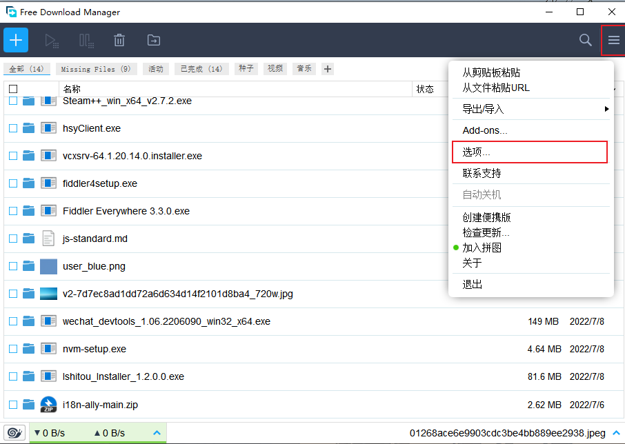
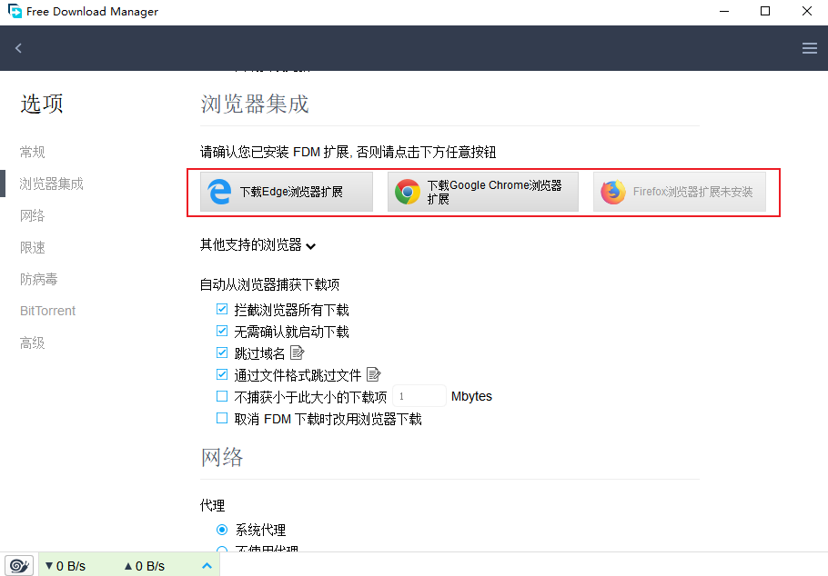
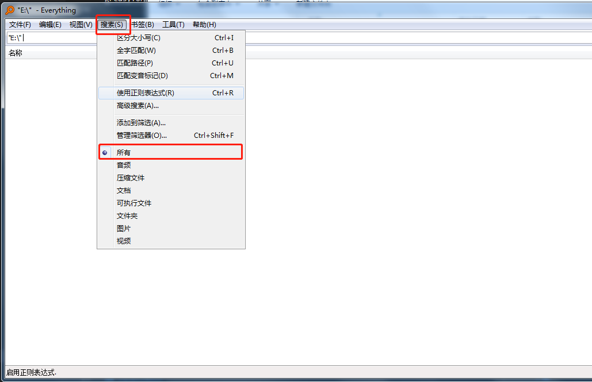
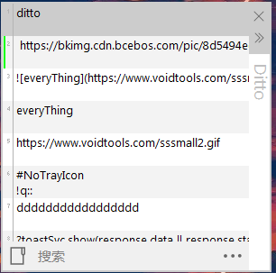
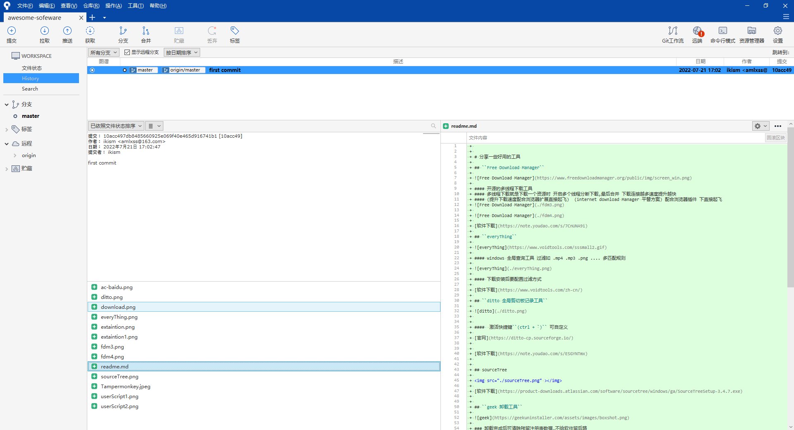
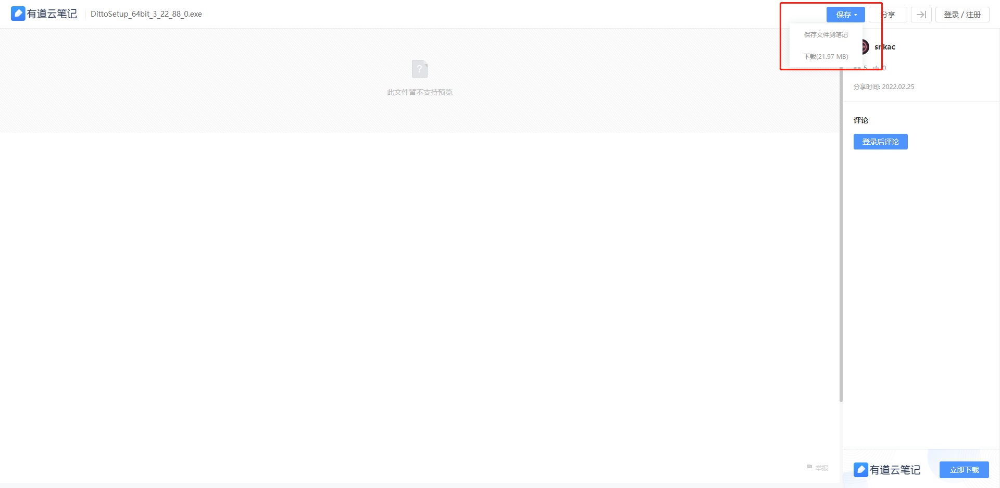
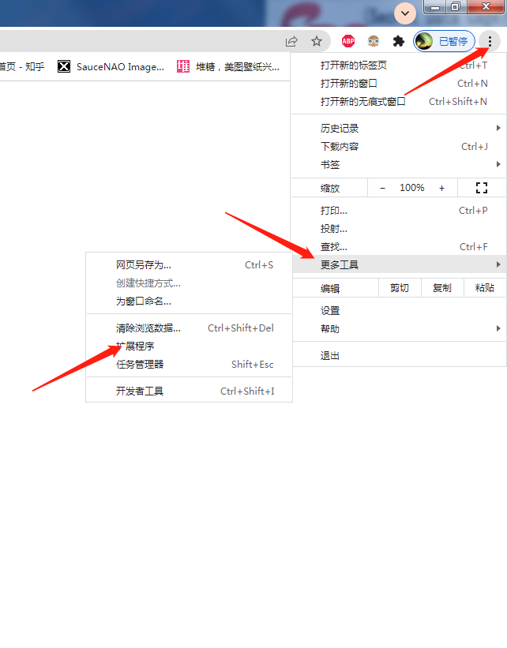
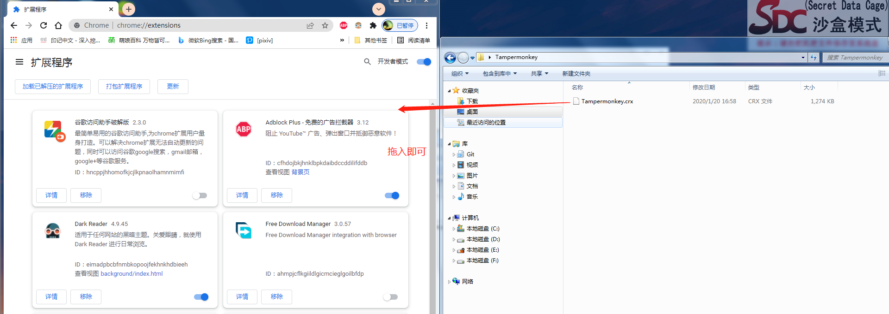
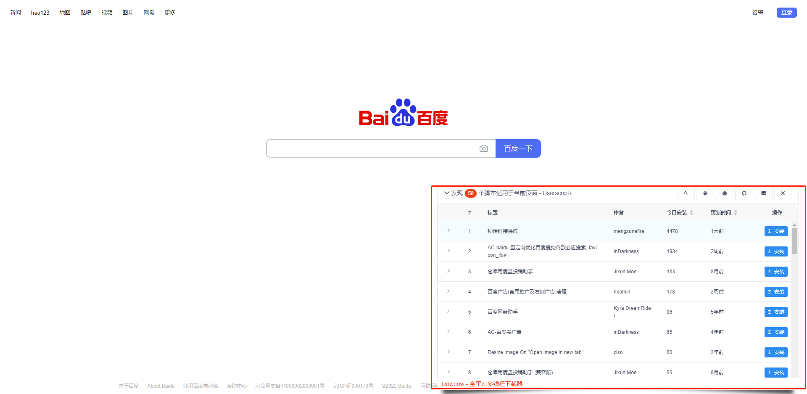

# 分享一些好用的工具

## ``Free Download Manager``

#### 开源的多线程下载工具  
#### 多线程下载就是下载一个资源时 开启多个线程分断下载,最后合并 下载连接越多速度提升越快
#### (提升下载速度配合浏览器扩展直接起飞)  (internet download Manager 平替方案) 配合浏览器插件 下直接起飞

[软件下载](https://note.youdao.com/s/7CnUNA9i)

## ``everyThing``

#### windows 全局查询工具 过滤如 .mp4 .mp3 .png .... 多匹配规则

#### 下载安装后要配置过滤方式

[软件下载](https://www.voidtools.com/zh-cn/)

## ``ditto 全局剪切板记录工具``

####  激活快捷键``(ctrl + `)`` 可自定义

[官网](https://ditto-cp.sourceforge.io/)

[软件下载](https://note.youdao.com/s/ESGYNTmx)

## sourceTree

</img>

#### 源代码管理工具 可以按需提交代码 可以清晰查看更改记录
#### 与小乌龟Tortoise 互有胜负

[软件下载](https://product-downloads.atlassian.com/software/sourcetree/windows/ga/SourceTreeSetup-3.4.7.exe)

## ``switchHosts``
[Github releases](https://github.com/oldj/SwitchHosts/releases)

### 可以按需更改hosts 文件 切换hosts 方案 加载运程hosts 等
## ``当然也可以用火绒的hosts更改工具``

## steam++ 工具 steam 辅助工具 本地反代工具(steam 商店,github,pixiv,stackOverflow etc. 加速)

[官网][https://steampp.net/]
[Github][https://github.com/BeyondDimension/SteamTools]

## Snipaste 高效截图工具

``下载到`` [官网](https://www.snipaste.com/download.html)

## ``revo uninstaller pro 卸载工具(绿色版)``

### 卸载完成后可清除残留注册表数据

[软件下载](https://note.youdao.com/s/6Bd744YW)

## 关于软件下载 部分软件为有道云分享 下载方式如下 

#  插画网站pixiv

## 电脑浏览器看

### 本地反代比steam++快
[pixiv-nginx Github](https://github.com/mashirozx/Pixiv-Nginx)

## 手机看

## pixiv 第三方app pixez (ios国内已下架,可以搞个港澳台的appleId下载)

[pixez Github](https://github.com/Notsfsssf/pixez-flutter)

# 浏览器插件

## ``adblock-plus``

### ``去浏览器广告 (强) ``

### ``由于墙的存在google插件商店无法使用``  可到[https://huajiakeji.com/](https://huajiakeji.com/) 或 [https://chrome.zzzmh.cn/#/index](https://chrome.zzzmh.cn/#/index) 下载 要关注公众号麻烦就是了

### 所以还是推荐先用火狐浏览器体验下

[google | edge 插件下载](https://note.youdao.com/s/VYezuKyn)

## ``Tampermonkey ``

### 最强浏览器插件

[google 谷歌 插件下载](https://note.youdao.com/s/CIo5NxxP)

### ``可以加载各种用户脚本,(无所不能)``

### google/edge(chromium内核)浏览器插件安装

### ``fireFox 火狐浏览器插件安装``

[########## fireFox 火狐插件主面](https://addons.mozilla.org/zh-CN/firefox/addon/tampermonkey/?utm_source=addons.mozilla.org&utm_medium=referral&utm_content=search)

[基于Tampermonkey 的脚本集合网站 - https://greasyfork.org/zh-CN](https://greasyfork.org/zh-CN)

### Tampermonkey 脚本

##### 要求浏览器安装Tampermonkey 
 
#### `ac-baidu` 重定向(去广告,双列显示,自动加载下一页)(`强`)

[安装脚本](https://greasyfork.org/zh-CN/scripts/14178-ac-baidu-%E9%87%8D%E5%AE%9A%E5%90%91%E4%BC%98%E5%8C%96%E7%99%BE%E5%BA%A6%E6%90%9C%E7%8B%97%E8%B0%B7%E6%AD%8C%E5%BF%85%E5%BA%94%E6%90%9C%E7%B4%A2-favicon-%E5%8F%8C%E5%88%97)

#### `Userscript+` : 显示当前网站所有可用的UserJS脚本 Jaeger (`强`)

#### 安装后打开任意网页 留意右下角图标 会显示所有适用当前网页的脚本

[安装脚本](https://greasyfork.org/zh-CN/scripts/24508-userscript-show-site-all-userjs)

### baidu 搜索

0.去广告搜索『intitle:（关键词）』

1.限定文件类型
『（关键词）filetype:（文件类型）』

＊常见文件类型:
 〔pdf〕PDF文件
 〔xls〕:excle文件
 〔ppt〕:powerpoint文件
 〔doc〕:word文件
 〔txt〕:文本文档.

 2.关键词包含在正文中
 『intext:（关键词）』

 3.限定搜索网站

 3.1『（关键词）site:（网站url）』
 限定搜索网站
 3.2『（关键词）inurl:（网站类型）』
 ＊常见网站类型
 〔.com〕商业组织和公司。
 〔.net〕网络服务商。
 〔.gov〕政府部门。
 〔.org〕非营利性组织。
 〔.int〕国际组织。
 〔.edu〕教育部门。

 4.限定搜索时间
 如需搜索2018-2019年
 『2018..2019』
 即『（开始时间）..（结束时间）』
 注：以上搜索方式可复合使用